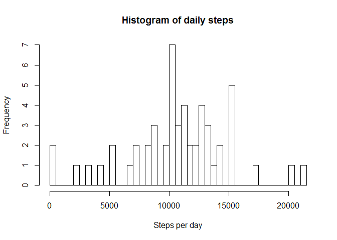
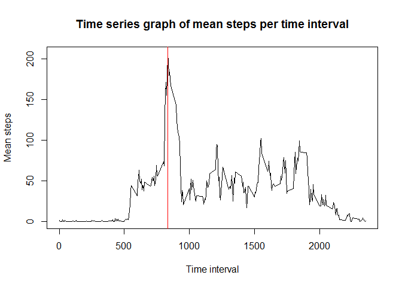
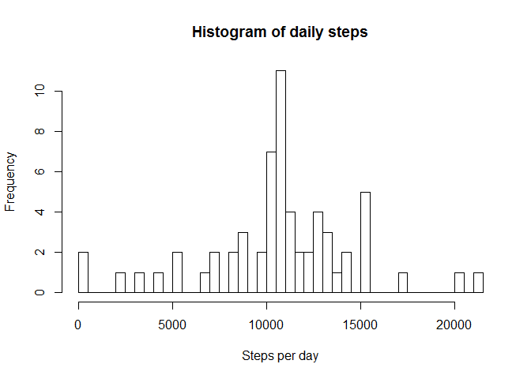
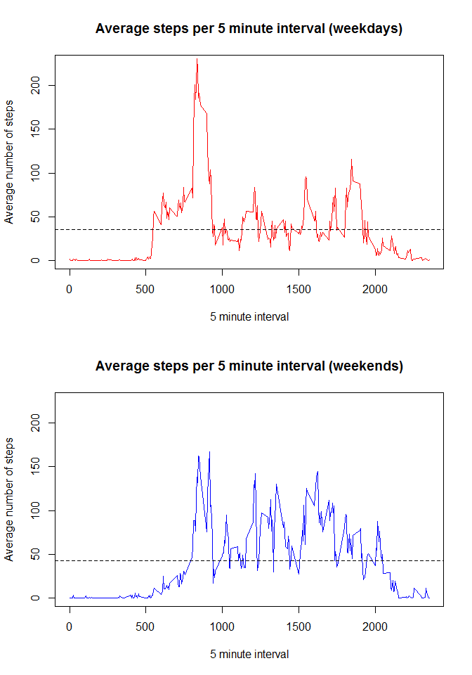

# Reproducible Research: Peer Assessment 1


## Loading and preprocessing the data

```r
  dat<-read.csv('activity.csv')
```


## What is mean total number of steps taken per day?

```r
options(scipen =1, digits=2)
stepsday<- tapply(dat$steps, dat$date, sum)
mn<-round(mean(stepsday, na.rm=T), digits=2)
med<-median(stepsday, na.rm=T)
hist(stepsday,breaks = 61, main='Histogram of daily steps', xlab='Steps per day')
```

 
  
*Mean* steps per day = **10766.19**  
*Median* steps per day = **10765**  

## What is the average daily activity pattern?

```r
stepsint<-tapply(dat$steps, dat$interval, function(x) mean(x, na.rm=T))
stepsintdf<-data.frame(stepsint)
stepsintdf$interval<-row.names(stepsintdf)
maxint<-stepsintdf$interval[stepsintdf$stepsint == max(stepsintdf$stepsint)]
plot(stepsintdf$stepsint~stepsintdf$interval,type='l',
     main= 'Time series graph of mean steps per time interval',
     xlab = 'Time interval', ylab='Mean steps')
abline(v=maxint, col='red')
```

 

The 5 minute interval with the *maximum number of average steps* is interval **835**  

## Imputing missing values

```r
noNAb<-sum(is.na(dat))
datimp<-dat
for(i in 1:nrow(datimp)){
  if (is.na(datimp$steps[i])){
    datimp$steps[i]<-mean(datimp$steps[datimp$interval==datimp$interval[i]], na.rm=T)
  }
}
noNAa<-sum(is.na(datimp))

stepsday2<- tapply(datimp$steps, datimp$date, sum)
mn2<-round(mean(stepsday2, na.rm=T), digits=2)
med2<-median(stepsday2, na.rm=T)
hist(stepsday2,breaks = 61, main='Histogram of daily steps', xlab='Steps per day')
```

 

```r
steptest<-t.test(stepsday, stepsday2)
```

The number of *missing values* in the original dataset is 2304  
The *mean* steps per day is **10766.19**  
The *median* steps per day is **10766.19**  
There was ***no significant difference*** between means with a **p value of 1**


## Are there differences in activity patterns between weekdays and weekends?

```r
datimp$date<-as.Date(datimp$date)
for (i in 1:nrow(datimp)){
  if(weekdays(datimp$date[i]) %in% c('Monday', 'Tuesday', 'Wednesday', 'Thursday', 'Friday')){
    datimp$day_of_week[i]<-'weekday'
  }
  else{
    datimp$day_of_week[i]<-'weekend'
  }
}
weekday<-datimp[datimp$day_of_week=='weekday',]
weekday_means<-tapply(weekday$steps, weekday$interval, mean)
weekend<-datimp[datimp$day_of_week=='weekend',]
weekend_means<-tapply(weekend$steps, weekend$interval, mean)
interval_mean<-data.frame(weekday_means, weekend_means)
interval_mean$interval<-row.names(interval_mean)
par(mfrow=c(2,1))
plot(interval_mean$weekday_means~interval_mean$interval, type='l',
     main='Average steps per 5 minute interval (weekdays)', 
     xlab='5 minute interval', ylab='Average number of steps',
     col='red',
     ylim=c(0,225))
abline(h=mean(interval_mean$weekday_means), lty=2)
plot(interval_mean$weekend_means~interval_mean$interval, type='l',
     main='Average steps per 5 minute interval (weekends)', 
     xlab='5 minute interval', ylab='Average number of steps',
     col='blue',
     ylim=c(0, 225))
abline(h=mean(interval_mean$weekend_means), lty=2)
```

 

```r
weektest<-t.test(interval_mean$weekday_means, interval_mean$weekend_means)
weektest
```

```
## 
## 	Welch Two Sample t-test
## 
## data:  interval_mean$weekday_means and interval_mean$weekend_means
## t = -1.9, df = 574, p-value = 0.05455
## alternative hypothesis: true difference in means is not equal to 0
## 95 percent confidence interval:
##  -13.64   0.13
## sample estimates:
## mean of x mean of y 
##        36        42
```

There appears to be *more* activity on average on the **weekends** than on **weekdays**. The hash lines on each graph represent the average 
steps per 5 minute interval. Average steps per interval on *weekdays* is **35.61**, and on the *weekend* is **42.37**. The p-value for this difference is **0.05**. 
